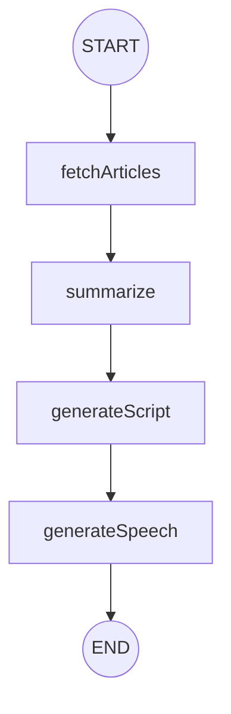

import AudioPlayer from "../../../components/AudioPlayer.astro";


This isn’t a tutorial or a product announcement. It’s a reflection on a side project I built, learned from, and eventually let go of. I wanted to understand how to automate audio content from web articles: turning text into podcast-style audio I would actually listen to. Along the way, I wrestled with tooling, pushed against the limits of AI-generated speech, and navigated orchestration complexity. This post captures that journey: what worked, what didn’t, and why I moved on.

### The Spark: Why I Started

The idea was simple: stay informed without needing to sit and read. My daughter had just been born, and I knew long-form articles were out. But I’d have time to listen. I imagined a personalized, automated podcast that could summarize relevant news or tech content, something I could queue up during walks or late-night feedings.

I wasn’t building a product or launching a tool. I wanted to experiment with unfamiliar systems like [text-to-speech (TTS)](https://en.wikipedia.org/wiki/Speech_synthesis), [local models](https://huggingface.co/docs/hub/en/models-downloading), and orchestration frameworks, to see what it would take to make them work together. My goal was to understand the moving parts by actually wiring them up.

It was about clarity over cleverness: taking a vague idea and turning it into something real enough to learn from.


### How I Tried to Make AI Voices Sound Human

The end goal was clear: an automated system that could take a set of articles, summarize them, convert the summaries into a two-speaker conversational script, and then generate audio files that sounded like a real dialogue. All of this needed to run with minimal manual steps, producing a podcast-like result I could listen to daily.

I wanted the output to sound human, not perfect, but pleasant. That meant natural pacing, varied tone, and two distinct voices that felt like co-hosts. I wasn’t aiming for deep character development, but I didn’t want it to feel robotic either. The two-speaker format was important: it breaks monotony and helps simulate conversational flow. One voice feels like a lecture; two voices, even if scripted, feel like an exchange.

To make this happen, I built a pipeline using [LangGraph](https://langchain-ai.github.io/langgraph/) to orchestrate the flow. The core stages were: fetch articles, summarize them, generate a script, convert it to speech, and finally stitch the audio together into a single file. Each stage could be debugged independently and improved in isolation. The modularity was key.

Here's a simplified version of that flow:



The architecture wasn’t groundbreaking, but it worked. It gave me room to experiment without losing track of the bigger picture.

I still remember the first time I played back one of the generated podcasts. It wasn’t great, a bit stiff and a little robotic, but hearing two voices trade lines from something I'd only seen as text felt surprisingly satisfying. It made the project feel tangible.

Building that first version was the easy part. The friction started once I tried to scale, refine, and own the full pipeline.


### Where Things Got Hard

#### Choosing the Right Language

Most AI tooling is built for Python, so that’s where I started. But I didn’t know the ecosystem well, and I quickly found myself spending more time fixing bugs than understanding tools. I’m much more fluent in TypeScript and comfortable with JavaScript runtimes, which let me build faster with fewer distractions. Switching to TypeScript gave me speed and control. I could prototype quickly and think about architecture instead of debugging syntax or dependency issues. I missed out on some plug-and-play integrations, but understanding what was happening under the hood made up for it.

Once the core language choice was settled, the next challenge was keeping track of everything: prompts, intermediate outputs, and experiments, without losing my place.

#### Memory and Workflow Tooling

To manage complexity, I experimented with [Cursor](https://www.cursor.com/) memory tooling: first [VanZan0’s memory bank](https://github.com/vanzan01/cursor-memory-bank), then [RiperSigma](https://github.com/johnpeterman72/CursorRIPER.sigma). Both had learning curves and limitations, but they helped me stay organized and track prompts, especially when juggling multiple runs or scripts. They weren’t perfect, but they nudged me toward a better workflow.

#### LangGraph: Flexible, but Demanding

LangGraph gave me clean orchestration with state management. But getting it to work the way I wanted wasn’t trivial. I hit friction when trying to enforce structure on the output, especially when feeding LLMs. Eventually, I built my own validation layer using [`zod-to-json-schema`](https://www.npmjs.com/package/zod-to-json-schema), which gave me reliability and confidence in the pipeline. I’m sure there’s a more idiomatic LangGraph approach, but mine worked, and I understood every part of it. That clarity helped me push through other challenges later on.

#### Tooling Overload

When exploring local models (AI models you run directly on your own machine rather than in the cloud), especially TTS, I fell into the classic trap: too many options, not enough clarity. [Hugging Face](https://huggingface.co/) offered a sea of possibilities, but it was hard to tell which were stable or worth investing in.

Local models gave me full control and no ongoing service costs, but they came with bigger setup headaches and fragile cross-machine portability. Hosted services were easier to integrate and more reliable across devices, but often came with usage fees and less transparency into how things worked. In the end, I leaned on hosted TTS for stability while keeping local options in my toolkit for experiments.

#### Voice Generation: More Art Than Science

[SSML](https://www.w3.org/TR/speech-synthesis/) (Speech Synthesis Markup Language) lets you control how text is spoken: pauses, pitch, emphasis, and more. It’s meant to make robotic speech sound more natural.

In practice, support was inconsistent. Some tags had no effect; others made things worse. I wrote a minimal SSML path: just enough to improve pacing without breaking things. Even with two distinct voices, the result often felt flat. [Crossfading](<https://en.wikipedia.org/wiki/Fade_(audio_engineering)#Crossfade>) helped, but it still didn’t feel like a real exchange. It was too smooth, too scripted.

Minimal SSML worked best. In the example below, I added a pause after the question and a light emphasis on a keyword: just enough to guide the listener without sounding artificial.

```xml
<speak>
  <p>Sarah: Quick take - does this handle questions well?</p>
  <break strength="medium"/>
  <p>Dan: Mostly. <emphasis level="moderate">Small</emphasis> pauses help; heavy styling hurts naturalness.</p>
</speak>
```

#### Newsfeed Integration: A Tangent Too Far

At one point, I tried to make the podcast feed itself, sourcing articles through Tavily and turning them into episodes. It sounded great on paper, but took a lot of duct tape to get working. Even then, the results weren’t good enough. I spent too much time wrestling with search APIs and ranking logic. Now I curate sources manually. It’s simpler, and more reliable.


### The Tools That Didn’t Fit - and What I Learned

As the project evolved, I tried a range of tools and services - some out of curiosity, others out of necessity. Most didn’t make it into the final version, but each one helped shape the path I took.

I evaluated tools based on three main criteria: portability, integration effort, and whether they let me stay close to my preferred stack. Cost and long-term maintainability also played a role, especially when weighing hosted versus local options.

#### **[Kokoro-JS](https://www.npmjs.com/package/kokoro-js)** – JavaScript wrapper for a local voice synthesis model

One of the earliest tools I tried was Kokoro-JS. The results were surprisingly promising for a quick prototype, but I had concerns about portability. It wasn’t clear how reliably it would run on machines other than my own, and it required more manual tuning than I wanted to commit to.

#### **[ElevenLabs](https://elevenlabs.io/)** – High-quality, natural-sounding hosted voices

I strongly considered using ElevenLabs, which is known for high-quality, natural-sounding voices. But it’s not free, and part of the challenge I set for myself was to see how far I could get without paying for a hosted service - and to explore the limits of what’s freely available.

#### **[Podcastfy](https://github.com/souzatharsis/podcastfy)** and **[Open-Notebook](https://github.com/lfnovo/open-notebook)** – CLI-based tools for automated podcast/script creation

Both Podcastfy and Open-Notebook looked interesting - well-scoped tools built for similar purposes. But they relied on CLI binaries or Python runtimes, and I didn’t want the overhead of integrating another process into my stack. I was optimizing for simplicity and control.

#### **[Google Cloud Text-to-Speech](https://cloud.google.com/text-to-speech)** – Hosted TTS with clear, contrasting voices

I eventually landed on Google Cloud Text-to-Speech, using two voices - Autonoe and Algieba - from the Chirp 3 HD family. After testing most of the available options, these stood out for their clarity and contrast. They weren’t flawless, but together they gave the two-speaker format a more natural rhythm.

- [en‑US‑Chirp3‑HD‑Algieba](https://cloud.google.com/static/text-to-speech/docs/audio/en-US-Chirp3-HD-Algieba.wav)
- [en‑US‑Chirp3‑HD‑Autonoe](https://cloud.google.com/static/text-to-speech/docs/audio/en-US-Chirp3-HD-Autonoe.wav)

You can browse the full list of available voices [here](https://cloud.google.com/text-to-speech/docs/list-voices-and-types).


Rather than chase a polished final product, I focused on what each version taught me. After every change - SSML tweaks, voice swaps, script edits - I listened. Not to a single clip, but to a mix of inputs. Did it sound more natural? Was it easier to follow? The only way to tell was to sit with the audio.

Automation would’ve helped, but this part couldn’t be automated. I had to trust my ears.

Progress came in stages: plain text, then SSML everywhere, then SSML dialed back to just enough. Voices changed, formatting evolved. Slowly, the audio started to feel like something I might actually choose to hear.

These kinds of small shifts - subtle choices in structure, format, or tooling - ended up mattering more than I expected. The evolution wasn’t dramatic, but it was real - and you can hear it.


### Audio samples

Here are three snapshots from the project’s evolution.

#### Early phase — no SSML

Ok‑ish, somewhat robotic, especially during questions and answers.

<AudioPlayer src="/blog-assets/building-ai-podcasts-and-letting-go/sample-1-non-ssml.wav" title="Sample 1: Early plain text output" />

#### Full‑blown SSML

Extremely robotic, not enjoyable to listen to.

<AudioPlayer src="/blog-assets/building-ai-podcasts-and-letting-go/sample-2-ssml-heavy.wav" title="Sample 2: Full SSML" />

#### Balanced version with touches of SSML

More natural, with occasional weird emotional cues (hear the 5 seconds for a cringy "AHH" as an example).

<AudioPlayer src="/blog-assets/building-ai-podcasts-and-letting-go/sample-3-final-balanced.wav" title="Sample 3: Final balanced version" />

Together they show the arc: the plain baseline is robotic, the SSML-heavy pass sounds less natural, and the final balanced version is the most listenable (though it can still be improved).


### What Held Up When Most Didn’t

A few parts of this project came together better than I expected. They gave the work direction, clarity, and a rhythm I could actually follow.

#### LangGraph + Zod: Orchestration and Structure

LangGraph helped structure the orchestration - defining stages, managing state, and making control flow visual and modular. The tough part came when I tried to validate outputs: while LangGraph claims to support schema validation out of the box, I ran into issues using it cleanly with TypeScript. Instead, I used [`zod`](https://zod.dev/) to define tool parameters and output shapes, then translated those into JSON schemas using `zod-to-json-schema`. This gave me reliable output validation that I understood end-to-end.

```ts
import { z } from "zod";
import { zodToJsonSchema } from "zod-to-json-schema";

const PodcastScriptSchema = z.object({
  speakers: z.array(z.string()),
  script: z.array(
    z.object({
      speakerIndex: z.number(),
      text: z.string(),
    })
  ),
});

const jsonSchema = JSON.stringify(zodToJsonSchema(PodcastScriptSchema));
const prompt = `...instructions...
The output must be a JSON object matching this JSON Schema:
${jsonSchema}
`;
```

#### Speaker-Indexed Script Format

A common approach is to generate the full script with speaker names on every line. But that wastes tokens and reduces the available context for downstream models. Instead, I added a short declaration at the top like `speakers: ["Alex", "Taylor"]`, then used indexed lines (`0:`, `1:`) to indicate speakers. It was cleaner, more efficient, and easier to work with.

#### Line-Based Audio Stitching

To keep things fast, I parallelized the audio generation, letting multiple chunks be processed by Google TTS at once. Instead of writing and reading temporary files, I streamed the results directly into memory. I then stitched the clips into a final audio file using simple logic and small crossfades. A crossfade overlaps the end of one clip with the start of another to smooth the transition.

The crossfades played a subtle but important role. Without them, the playback felt abrupt, as if one speaker snapped in immediately after the other. With them, the timing felt more conversational, less like a list being read out loud.

None of these changes made the voices truly human, but they gave me a system I understood fully: how it worked, why it worked, and where it might go next. That sense of ownership made the process rewarding.


### Why I Stopped

Even as things improved, some challenges stuck around. The output got better, but it still wasn’t something I’d consistently want to listen to. Long articles bumped into [context limits](https://platform.openai.com/docs/guides/limitations). I knew how to fix that ([chunking](https://learnprompting.org/docs/advanced/chunking), [hierarchical summarization](https://pieces.app/blog/hierarchical-summarization)), but it would take real engineering time to do it right.

And that was the theme: I knew how to keep going - I just didn’t want to.

The remaining issues weren’t mysteries. They were either uninteresting (like markdown/code cleanup), tedious (better SSML handling), or required deep exploration into areas I already knew others had solved - just not in this exact configuration. The ROI wasn’t there.

Meanwhile, the project’s surface area kept growing: media handling, smarter source selection, real-time updates. All technically solvable. None worth the burn.

More importantly, I had learned what I came to learn. I had real experience orchestrating tools with LangGraph, working with local and cloud-hosted models, fine-tuning prompt formats, structuring LLM output, and understanding how TTS models work (and where they still fall short).

What remained were either cleanup tasks or product polish - not where I wanted to spend time.

From the start, I wasn’t aiming to ship a product. I wanted to explore the moving parts and learn what it takes to make them work together. These were my goals going in:

- Understand how to connect LLMs, speech synthesis, and orchestration tools into a working system.
- Get hands-on experience shaping prompts, structuring outputs, and debugging edge cases.
- Evaluate trade-offs between hosted and local tools - what matters in practice, not in theory.
- Build something I would actually choose to listen to, even if just occasionally.
- Know when to stop: not when everything’s perfect, but when the project has taught me enough.

So I stopped. Not because it failed, but because it delivered. The project had taught me what I needed to know. And that clarity gave me permission to move on - which led me to thinking about automating [NotebookLM](https://notebooklm.google/), a simpler and better-aligned solution for the same core goal. This will be covered in a different post.


### What Paid Off - and What I Should’ve Let Go Sooner

If I were starting this project today, I’d still reach for LangGraph and stick with the two-host format. Those choices made sense from start to finish. I’d skip the personalized newsfeed detour - interesting on paper, but not worth the overhead in practice.

Beyond that, I wouldn’t try to replicate this path. I explored things that didn’t work, used tools I eventually dropped, and took detours that burned time. But each of those choices taught me something - about orchestration, voice modeling, Hugging Face, prompt shaping, memory frameworks, or just how systems behave under pressure.

What I came away with isn’t a clean blueprint - it’s a better sense of what matters when working with AI tooling. I now understand how to structure workflows around LLMs, evaluate the trade-offs between hosted and local models, and spot where orchestration gets messy. I got hands-on with tools like LangGraph, TTS APIs, Hugging Face models, and memory frameworks - and learned how to evaluate them, adapt them, or walk away from them.

I wasn’t chasing production-level polish. I wanted to learn where the real challenges were, and decide what was worth my attention.


### The Results, the Code, the Next Step

If you’re interested in digging deeper, I’ve included audio samples from various stages of the project above. They offer a clearer sense of how the outputs evolved - and where they still fall short.

The full codebase is [available on GitHub](https://github.com/omril321/podcast-generator) with rough edges noted. This isn’t an actively maintained tool, and it’s not intended to become one. But if you’re exploring similar workflows - summarization, scripting, or audio generation - it might offer useful patterns or shortcuts.

I also wrote about where I went next, automating NotebookLM to tackle a similar problem in a very different way. That’s covered in a separate post.

If you’ve built something similar, explored the same friction points, or just thought about stitching AI systems together in your own way, I’d love to hear about it.


