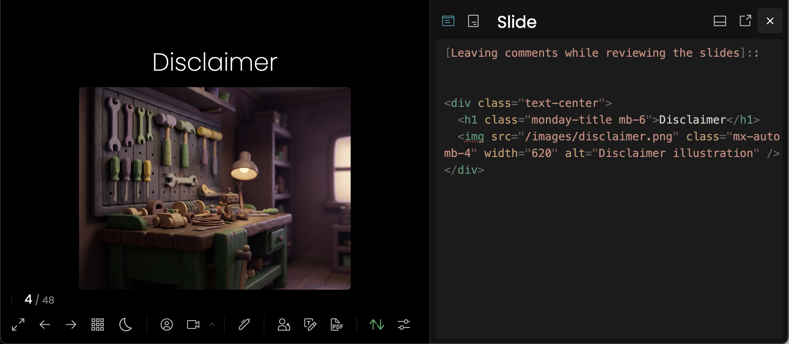
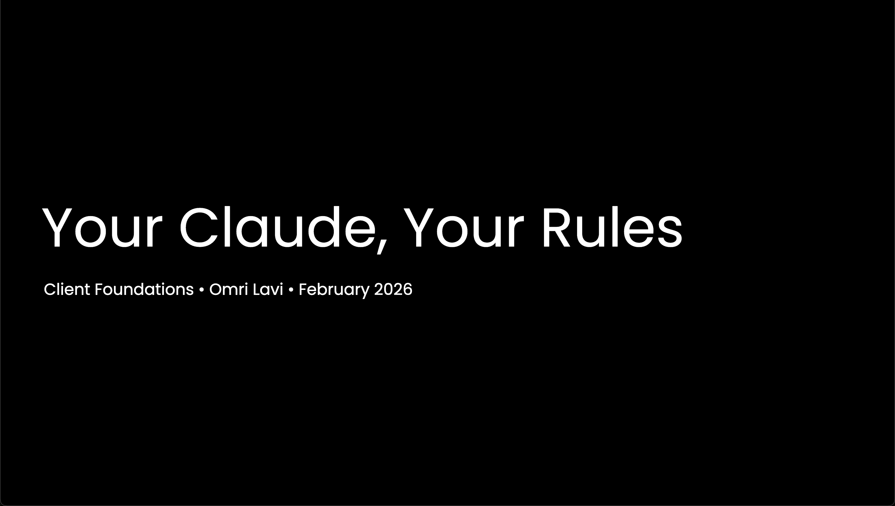
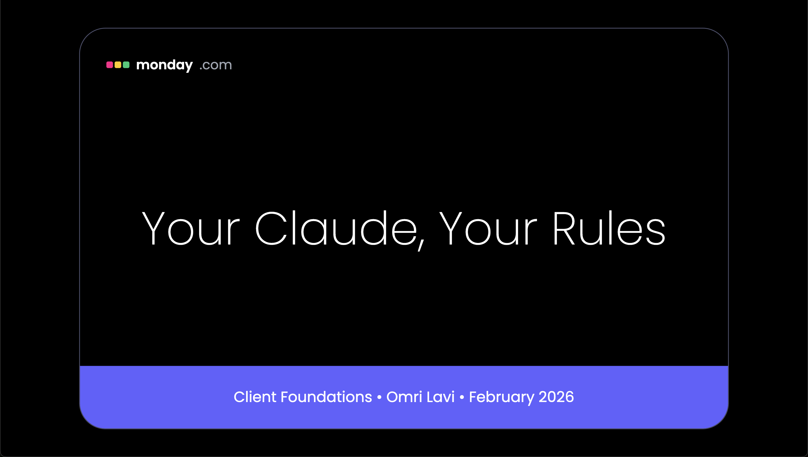

Somewhere in the middle of outlining a presentation about my Claude Code setup, the irony hit me: why not use Claude Code to generate the presentation itself?

So I did. This post walks through the workflow I used to go from a blank screen to a finished slide deck: Slidev for Markdown-based authoring, custom templating for my personal look and feel, and AI-generated images to tie it all together.

## Why Slidev?

[Slidev](https://sli.dev/) is a Markdown-based presentation framework. You write slides in plain text, and it renders them as a web-based deck. Restructuring is just cut-and-paste. Preview is instant. And version control works the way you'd expect.

But what makes it interesting is how hackable it is. Slidev is built on Vue and Vite, so you can drop in custom components, animate code blocks, add live-editable snippets, or build your own layouts. Start simple with Markdown, scale up to full Vue components when you need them.

Bottom line: your presentation is just code. And guess who's really good at working with code?

## The Workflow

Here's the approach that worked for me.

### 1. Start with content, not styling

I started by giving Claude Code context: what the presentation was about, who the audience was, and a few references. Those references could be links, pieces of code, or even a brainstorm from a previous chat.

From there, I asked it to draft the slides in plain Markdown. No styling, no layout decisions. Just the story I wanted to tell, broken into slides.

This kept things simple. I could restructure, add, or cut slides without worrying about how they looked. The goal at this stage was to get the content right.

### 2. Leave comments while reviewing

Slidev lets you edit slides directly in the browser while previewing them. I used this to leave inline comments as I reviewed the deck. Things like "this slide feels too dense" or "add a visual here."

Then I'd tell Claude Code: "I added comments to the slides. Review and address them." It would read the file, process the feedback, and make the changes.

No copy-pasting. Just review, comment, and let Claude take another pass.

### 3. Apply your template late

Once the content was solid, I introduced the template. This is where the deck got its look and feel: colors, fonts, layouts, the whole visual identity.

I waited until the end for a reason. Templates in Slidev often mean moving from Markdown to HTML and Vue components. That's more complex to edit. If you apply the template too early, every content tweak becomes harder.

Draft first. Style last.

### 4. Generate consistent images

While drafting, I didn't worry about visuals. Instead, I left placeholders: short descriptions of what image should go where. "Diagram showing the feedback loop" or "Icon representing automation."

Once the content was complete, I worked on finding the right visual theme. The [generate-image](https://github.com/omril321/claude-code-setup) skill generates a batch of options and asks which one fits best. After 3-4 rounds, I found a style that worked.

From there, I locked that style in as a theme. The `slidev` skill passes the same theme to every image generation call, so when I generated all the images in one batch, they came out visually consistent.

No hunting for stock photos. No manual editing for consistency. Define the theme once, and let the skills coordinate.

## The "Wow" Moment

The moment I applied the template, everything clicked.

The deck went from "generic Slidev output" to something that looked like it belonged. Even the list items appeared the way I wanted, fading in slightly transparent before showing fully. The background colors were right. The fonts matched. The layout felt intentional. It wasn't Google Slides, but it looked just as polished.

That transformation is the emotional payoff of this whole workflow. You spend time drafting content in plain Markdown, iterating on structure, leaving the visuals for later. And then, in one step, the template snaps in and suddenly it looks real.

**Before:**

**After:**

That said, this approach comes with some tradeoffs.

## Tradeoffs and Gotchas

This workflow isn't for everyone. Here's what to consider:

**Templating moves you from Markdown to HTML.** Once you introduce a custom template, you're often editing HTML and CSS instead of simple Markdown. That's harder to work with. The workaround: draft content first, apply the template late.

**Collaboration with non-technical folks is harder.** Slidev is great when you're the sole author. But if you need real-time collaboration with people who aren't comfortable with code, Google Slides is still the smoother path.

**The last 10% takes time.** Getting the template to look exactly right (spacing, layout quirks, edge cases with long text) requires iteration. The template doesn't solve everything on the first try.

**It's not a replacement for design.** If you need pixel-perfect marketing decks with constant visual iteration in meetings, this isn't the tool. Slidev shines for internal talks, technical presentations, and decks where content matters more than polish.

## Try It Yourself

This whole workflow is packaged as a [`slidev` skill](https://github.com/omril321/claude-code-setup) in my Claude Code setup. It's not a one-off prompt. It's a structured system: skills that call other skills, commands for common tasks, hooks that keep context fresh. That's what makes it repeatable.

If you want to try it, the repo is public. Curious what creative ways you've found to use Claude Code for things people don't usually think about.
