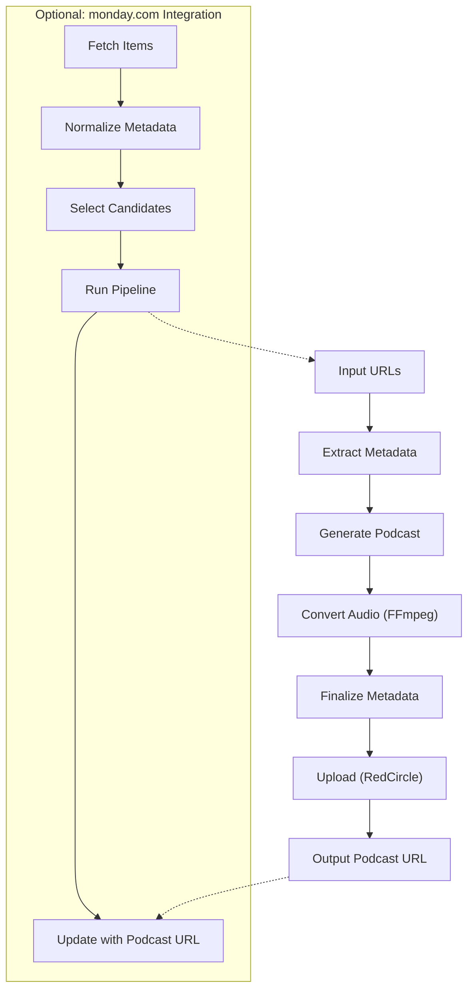
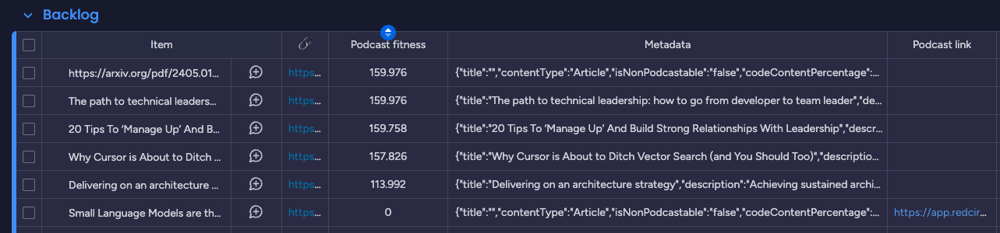

import VideoPlayer from "../../../components/VideoPlayer.astro";

## When Reading Didn’t Fit, Listening Stepped In

After my daughter was born, my ability to sit and read collapsed. Articles piled up. Newsletters went unread. But my podcast queue? That kept moving. Whether I was walking with a stroller or making coffee, I still had time to listen, just not to read.

Meanwhile, AI was moving fast. New frameworks, papers, tools, and shifts in thinking flowed by faster than I could keep up. I wanted to stay informed, to keep learning, but I needed a different interface for it. One that matched my new constraints - including something lightweight like a monday.com board where I could queue up articles without friction.

That's what this post is about: building a personal system that turns web articles into high-quality podcasts automatically, using [NotebookLM](https://notebooklm.google/), browser automation with [Playwright](https://playwright.dev/), and a flexible [monday.com](https://monday.com) board flow. I'll walk through the design, the constraints, the failures, and the lessons learned - not as a product pitch, but as a blueprint for hacking around the edges of tools that weren't designed to be automated. If you'd rather explore the code directly, it's available on [GitHub](https://github.com/omril321/automated-notebooklm).

<VideoPlayer 
src="/blog-assets/turning-articles-into-podcasts/articles_into_podcasts.mp4" 
description="The system in action, easily converting an article into a podcast episode." 
/>

## When Great Results Are Trapped in a Bad Experience

Once I started experimenting, NotebookLM quickly stood out. Its studio podcast feature doesn’t just summarize, it produces a natural-feeling conversation, often between two distinct personas, that sounds like a real podcast. The tone is calm, the structure clear, and the quality genuinely high. I tried open-source tools like [Podcastfy](https://github.com/souzatharsis/podcastfy) and [open-notebooklm](https://github.com/gabrielchua/open-notebooklm), and while they work well, the results didn’t come close to the output quality I consistently got from NotebookLM.

But there was one big problem: it wasn’t automatable. There’s no API. No way to script uploads, trigger generation, or extract the audio programmatically. The whole flow had to be driven manually, click by click, inside a browser UI designed for individuals, not workflows.

To get a single article turned into a podcast episode I could hear on my phone, I had to:

- Log in
- Create a notebook
- Add the article as a resource
- Generate the podcast (and wait 10–12 minutes)
- Download the WAV file
- Convert it to MP3 with [FFmpeg](https://ffmpeg.org/)
- Upload it to a podcast hosting platform like [RedCircle](https://redcircle.com/)

The result was excellent, and once published, the episode would automatically appear in my podcast app via subscription. But the path to that outcome was slow, fragile, and full of steps I’d rather automate. Not because I needed scale, just because I didn’t want to repeat the same tedious flow every day.

## Tired of Repeating Steps, I Automated the Whole Thing

The goal wasn’t to scale up, it was to stop repeating the same steps by hand. I wanted a system where I could feed it one or more URLs, walk away, and later find real podcast episodes waiting in my feed. No clicking. No downloading. No babysitting.

That system now exists. It launches a browser, logs into NotebookLM, creates a new notebook, adds a URL as a resource, waits for the podcast generation to finish, downloads the resulting WAV, converts it to a high-quality MP3 with ffmpeg, and uploads the final audio to RedCircle. Once published, the new episode automatically appears in my podcast player via subscription.

You can explore the architecture and source code [on GitHub](https://github.com/omril321/automated-notebooklm), which includes a diagram of the full pipeline:

There’s also an optional integration with a monday.com board. That lets me add potential articles with minimal friction, either by pasting a URL into the item name or setting the name and link separately. The system then:

- Normalizes and enriches the board items
- Analyzes each link for code density, video presence, and other metadata
- Scores the content for podcast suitability
- Selects the top N articles (within daily generation limits)
- Generates and uploads episodes
- Updates each item with the podcast link

This makes the whole process incredibly lightweight: I can add links from my phone, let the system run overnight, and wake up to a set of episodes ready to go.

## Behind the Curtain: Hacks, Shortcuts, and a Monday Integration

Because there’s no official API for NotebookLM or RedCircle, the system uses full browser automation to control the flow. It runs a real Chrome instance, not headless, and includes several mitigations to reduce the chance of being flagged as a bot. If you're curious about the exact techniques, the best reference is [the code itself](https://github.com/omril321/automated-notebooklm).

The monday.com board adds another layer of intelligence. I can add links casually, from any device, and the system takes care of the rest. It fetches each article and extracts structured metadata:

- Title and meta description
- Code block density (since articles with lots of code are usually better read than heard)
- Total text length
- Embedded video detection

These signals feed into a lightweight scoring system that helps filter out poor fits. Only high-scoring, unprocessed articles are selected, up to a daily cap, and passed through the podcast generation pipeline.

There are additional automations running inside the board itself, including some powered by AI, which enhance and structure content further. There’s more to say about how these internal automations work - some use board logic, others call AI-based enrichment tools - but that’s covered in a different post.

*A real look at the monday.com board: I add items casually, and the system enriches them with metadata, scores podcast fitness, and tracks output.*

## Elegance Got Me Started - Resilience Kept It Running

This wasn’t an exercise in building a perfect system, it was a response to the constraints I actually had. Automation targets changed. Interfaces evolved. Some things worked one day and failed the next. So I didn’t aim for robustness in the textbook sense. I aimed for resilience in the lived sense.

That meant prioritizing clarity over cleverness. Fail early if something’s broken. Don’t leave the system in a weird state. Focus on paths that are easy to restart and hard to silently misfire. None of this is elegant, but it’s dependable enough to run daily without hand-holding.

And in a setup like this, that’s not a compromise. That’s the architecture.

## Bending the Rules Without Breaking Them

This project probably steps outside the terms of use for both NotebookLM and RedCircle. Most consumer-facing platforms don’t support browser automation, even when it’s respectful, rate-limited, and entirely local.

That said, I’ve always been drawn to edge cases, places where tools weren’t meant to be used this way, but kind of work anyway. Whether it’s [using TypeScript types at runtime](https://engineering.monday.com/how-typescripts-compiler-helped-us-prevent-redux-performance-issues/) or [finding strange ways to shrink a bundle](https://engineering.monday.com/the-superpower-of-babel-how-we-saved-16-on-our-bundle-size/), I tend to poke at the boundaries just to see what’s possible.

This isn’t meant as a recommendation, or even a reusable solution. It’s just a sketch, an experiment in making the tools I already use fit into the life I actually have. If you try something similar, do it carefully, and know the risks going in.

## The Real Payoff: Learning While Life Keeps Moving

This system isn’t stable or polished. It leans on brittle UIs, long wait times, and a stack of conditional logic to survive automation-hostile platforms. But it works – and that’s enough to turn ordinary moments, like walks or dishes, into time for learning and reflection.

The real takeaway is this: creative thinking can turn limited tools into meaningful workflows. You don’t always need official integrations or perfect architecture to improve your learning habits or quality of life. Sometimes, the best solutions come from shaping the tools you already have into something that fits you better.

If this sparked any ideas - or if you’ve built something similar or better - I’d love to compare notes.

